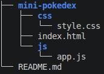
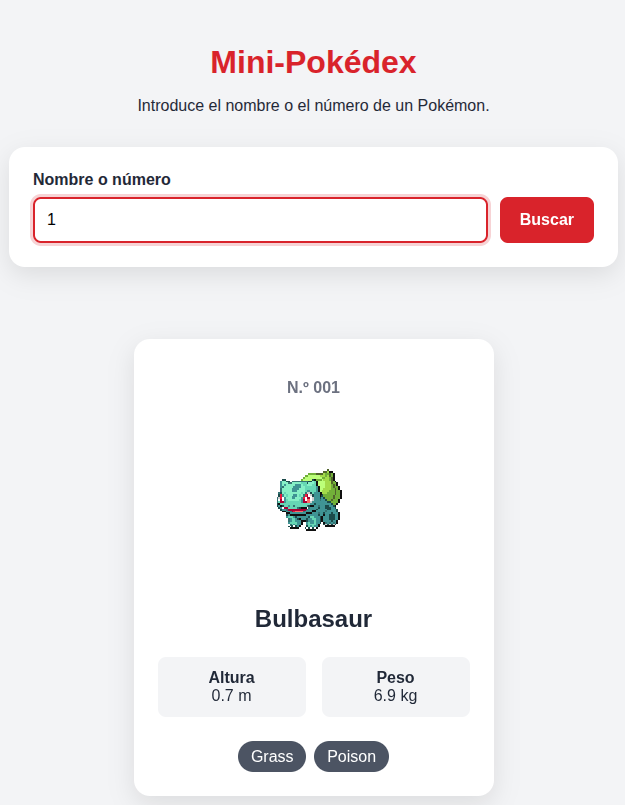
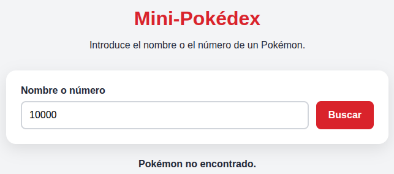
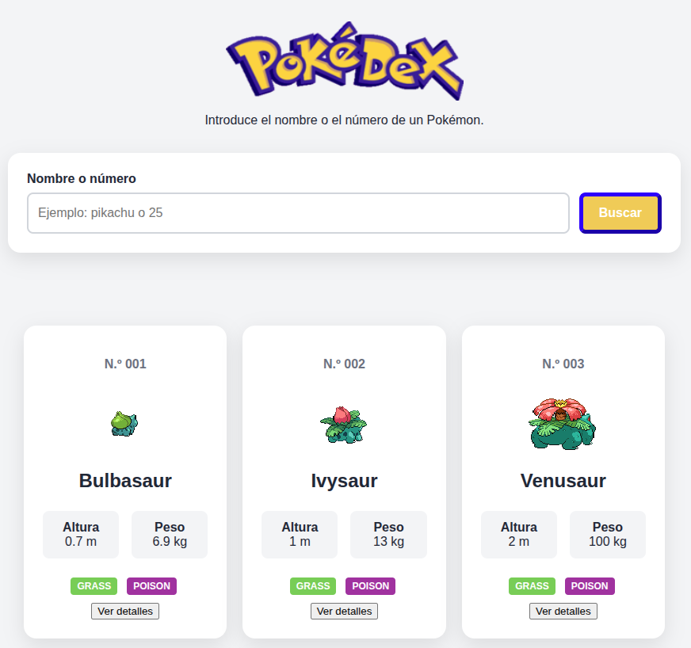
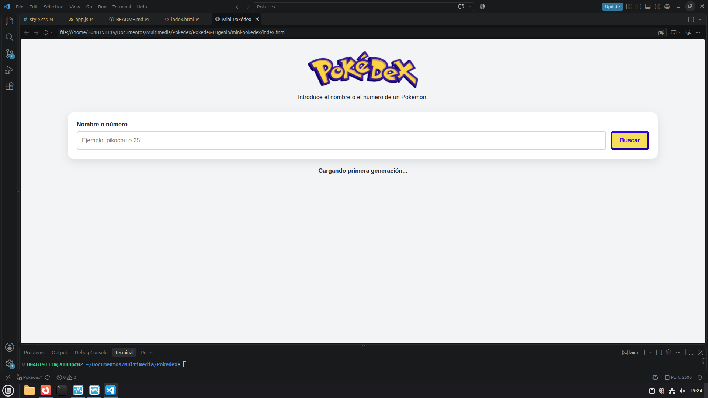
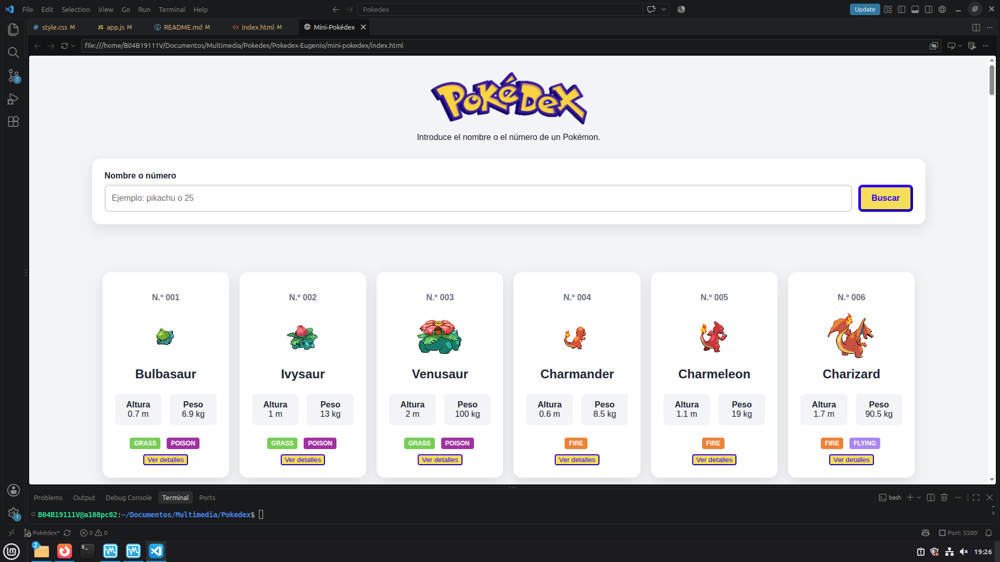
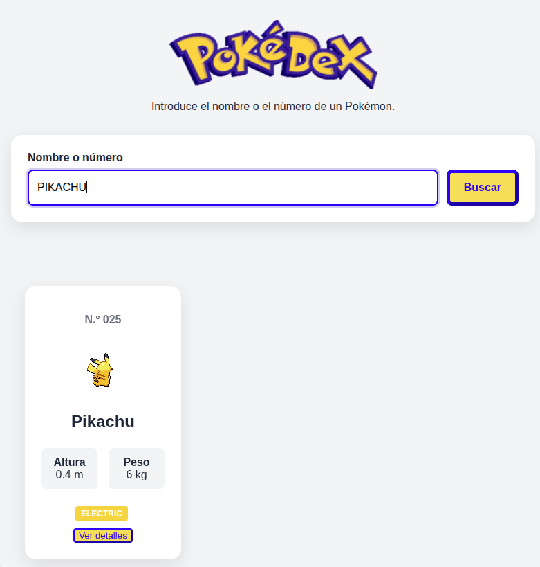
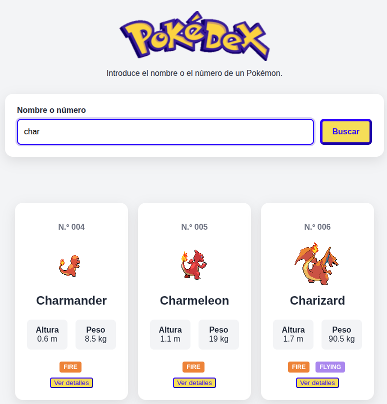
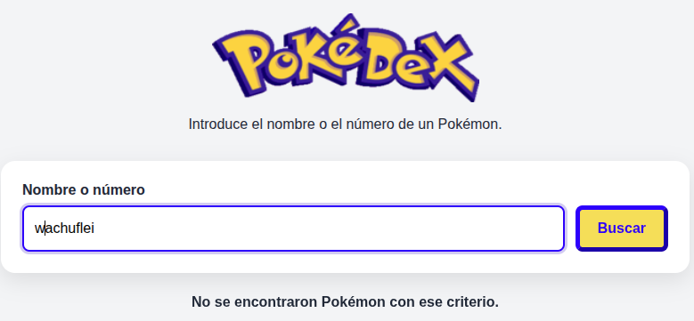

# Pokedex-Eugenio

## 1. Punto de partida
Hasta ahora he desarrollado una aplicación sencilla que consiste en un buscador de Pokémon conectado a la API oficial de Pokémon capaz de buscar entre 1351 pokémons por su nombre o identificador

Imagen del árbol de carpetas:

Imagen de la aplicación funcionando:

Imagen de una búsqueda incorrecta:

# 19. Preguntas de comprobación PrePokedex

## Responde en tu cuaderno o en un archivo Markdown:

###    ¿Por qué escuchamos el evento submit del formulario?
Para poder ejecutar la búsqueda cuando se confirme el formulario

###    ¿Qué ocurriría si eliminamos evento.preventDefault()?

Que la búsqueda realizada desaparecería de la barra de búsqueda.

###    ¿Para qué utilizamos trim() y toLowerCase()?

Para eliminar espacios adicionales y transformar la búsqueda a minúsculas para ser introducido en la llamada a la API.

###    ¿Por qué obtenerPokemon() está declarada con async?

Para que la función obtenerPokemon() pueda realizar operaciones asíncronas y devolver una promesa.

###    ¿Qué devuelve fetch()?

Una promesa.

###    ¿Para qué se utiliza await?

Para que el programa espere a que la petición sea realizada para seguir ejecutándose.

###    ¿Por qué debemos comprobar respuesta.ok?

Para comprobar que la página no de error, siendo true cuando el código HTTP se encuentra entre 200 y 299.

###    ¿Qué hace respuesta.json()?

Transformar la información recibida de la API en formato JSON.

###    ¿Por qué no devolvemos directamente todos los datos recibidos?

Porque la API devuelve muchísima información que no nos interesa obtener si no filtras la respuesta que te da.

###    ¿Qué resultado produce map() al transformar los tipos?

Consigue recorrer el array de los tipos de los pokémon y los coloca en un array.

###    ¿Por qué utilizamos join("") después de map()?

Para que los tipos del pokémon no aparezcan separados por comas

###    ¿Qué diferencia existe entre try y catch?

Que el try intenta ejecutar su contenido y en caso de que haya algún error salte al catch directamente

###    ¿Por qué hemos separado obtenerPokemon() y mostrarPokemon()?

Para separar responsabilidades del código haciendo más sencilla su comprensión

###    ¿Qué función cumple formatearId()?

La de añadir el número de ceros necesarios hasta llegar a las 3 cifras en caso de que el número sea de una o dos cifras

###    ¿Qué habría que modificar para mostrar varios Pokémon simultáneamente?

En mi caso he creado una función que los carga todos en una variable y otra función para mostrarla en un grid.

## 3. Resultado esperado

En primer lugar he creado una función para cargar las tarjetas de los 151 primeros pokemon y la he llamado al principio del archivo javascript para que aparezca en pantalla al renderizar la web.
En segundo lugar he añadido un + antes del igual del resultado.innerHtml de la función mostrarPokemon para acumular las tarjetas de los pokémon y que no sustituya una por la que había previamente
Por último para lograr que aparezca el pokemon de espaldas inicialmente y que al hacer hover se gire he añadido dos variables en la funcion obtenerPokemon, una para la foto frontal y otra para la de espaldas y luego en la función mostrarPokemon he añadido las dos imágenes al mismo contenedor para después jugar con su visualización mediante la opacidad desde el CSS

1. Punto de partida

    Descripción de la mini-Pokédex obtenida en la práctica guiada.
    Estructura inicial del proyecto.
    Funcionalidades que ya estaban disponibles.
    Pruebas realizadas antes de comenzar las ampliaciones.
    Capturas que demuestren que el proyecto inicial funciona.
    Enlace o identificador del commit inicial.

2. Carga de los 151 Pokémon

    Cambios realizados respecto al código inicial.
    Explicación de la consulta y transformación de los datos.
    Problemas encontrados y soluciones aplicadas.
    Capturas de la colección cargada.

    He creado una función llamada cargarPrimeraGeneracion() destinada a cargar la primera generación que recorre con un bucle los primeros 151 pokémons de la API y los muestra mediante otra función llamada mostrarPokemon()

3. Construcción de las tarjetas

    Datos seleccionados de PokéAPI.
    Explicación de la generación dinámica de las tarjetas.
    Implementación del cambio entre el sprite trasero y el frontal.
    Capturas del resultado normal y del estado al pasar el cursor.

4. Barra de búsqueda y filtros

    Explicación del funcionamiento de la búsqueda.
    Explicación del filtro por tipo.
    Forma de combinar ambos filtros.
    Capturas de varios casos de prueba.

5. Información ampliada

    Explicación del panel de detalles.
    Datos adicionales mostrados.
    Capturas del panel abierto y cerrado.

6. Gestión de estados y errores

    Estado de carga.
    Búsquedas sin resultados.
    Errores de comunicación con PokéAPI.
    Capturas o evidencias de las pruebas realizadas.

7. Pruebas finales

    Tabla completa de pruebas.
    Resultado obtenido en cada caso.
    Correcciones realizadas después de las pruebas.

8. Conclusiones

    Dificultades encontradas.
    Conocimientos adquiridos.
    Posibles mejoras futuras.

    Las dificultades encontradas han sido acostumbrarme a trabajar con funciones flecha y aprender cómo funcionan las promesas

    He adquirido el conocimiento de aprender a estructurar las funciones en mi archivo javaScript para organizarme mejor con el código y 

Además, el archivo deberá incluir:

    Nombre del proyecto.
    Nombre del autor o autora.
    Descripción de la aplicación.
    Tecnologías utilizadas.
    Instrucciones para ejecutarla.
    Estructura del proyecto.
    Funcionalidades implementadas.
    Enlaces a commits relevantes cuando se termine cada fase.

| Prueba | Resultado esperado | Evidencia (Imagen) |
| :--- | :--- | :--- |
| Abrir la aplicación | Se muestra la interfaz inicial sin errores | |
| Iniciar la carga | Aparece un mensaje de carga | |
| Finalizar la consulta | Se muestran 151 tarjetas | |
| Buscar pikachu | Solo aparece Pikachu | |
| Buscar 25 | Solo aparece Pikachu | |
| Buscar char | Aparecen los Pokémon cuyo nombre contiene ese fragmento | |
| Buscar un nombre inexistente | Se muestra un mensaje sin errores técnicos | |
| Vaciar la búsqueda | Vuelven a mostrarse todos los Pokémon | |
| Seleccionar el tipo fire | Solo aparecen Pokémon de tipo fuego | |
| Combinar texto y tipo | Se cumplen simultáneamente ambos filtros | |
| Colocar el cursor sobre una tarjeta | El sprite cambia de espalda a frente | |
| Retirar el cursor | Vuelve a mostrarse el sprite trasero | |
| Pulsar Ver detalles | Aparece toda la información ampliada solicitada | |
| Cerrar los detalles | El panel desaparece sin recargar la página | |
| Simular un fallo de conexión | Aparece un mensaje y se puede reintentar | |
| Reducir el ancho de la ventana | Las tarjetas se adaptan sin desbordamientos | |
